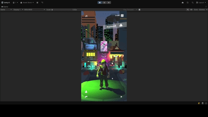
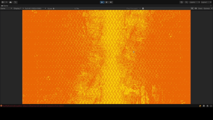
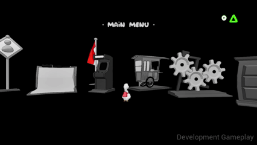
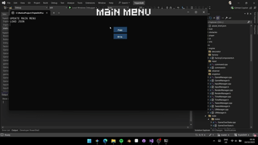

### Hi there, I'm Aditya 👋

I'm a Game Programmer from Indonesia. I'm passionate about writing clean & optimized code, designing scalable gameplay systems, and exploring robust game architecture patterns. Currently, I'm diving deep into low-level game development.

---

### 🎮 My Projects

<table>
  <tr>
    <td width="50%">
      <h3 align="center">Criminal</h3>
      

        
         
        <em>deskripsi.</em>
         
        

          <a href="games/criminal/Criminal.md" target="_blank">
            <b>View Detail</b>
          </a> 
        

      

    </td>
    <td width="50%">
      <h3 align="center">Indekos</h3>
       

        
         
        <em>deskripsi.</em>
         
        

          <a href="[LINK-REPO-GITHUB-PROYEK-INI-2]" target="_blank">
            <b>View Detail</b>
          </a> 
        

      

    </td>
  </tr>
  <tr>
    <td width="50%">
        <h3 align="center">Duck</h3>
         

          
           
          <em>deskripsi.</em>
           
          

            <a href="[LINK-REPO-GITHUB-PROYEK-INI-2]" target="_blank">
              <b>View Detail</b>
            </a> 
          

        

      </td>
  <td width="50%">
      <h3 align="center">Triple Shift</h3>
       

        
         
        <em>deskripsi.</em>
         
        

          <a href="[LINK-REPO-GITHUB-PROYEK-INI-2]" target="_blank">
            <b>View Detail</b>
          </a> 
        

      

    </td>
  </tr>
  <tr>
    <td width="50%">
        <h3 align="center">Neo Strife</h3>
         

          
           
          <em>deskripsi.</em>
           
          

            <a href="[LINK-REPO-GITHUB-PROYEK-INI-2]" target="_blank">
              <b>View Detail</b>
            </a> 
          

        

      </td>
  <td width="50%">
      <h3 align="center">Dgreek Cook</h3>
       

        
         
        <em>deskripsi.</em>
         
        

          <a href="[LINK-REPO-GITHUB-PROYEK-INI-2]" target="_blank">
            <b>View Detail</b>
          </a> 
        

      

    </td>
  </tr>
  <tr>
    <td width="50%">
        <h3 align="center">Carnival</h3>
         

          
           
          <em>deskripsi.</em>
           
          

            <a href="[LINK-REPO-GITHUB-PROYEK-INI-2]" target="_blank">
              <b>View Detail</b>
            </a> 
          

        

      </td>
  </tr>
</table>

---

### 🛠️ My Tech Stack

  
  
  
  
  

---

### 📫 Let's Connect!

  
  
  
  

