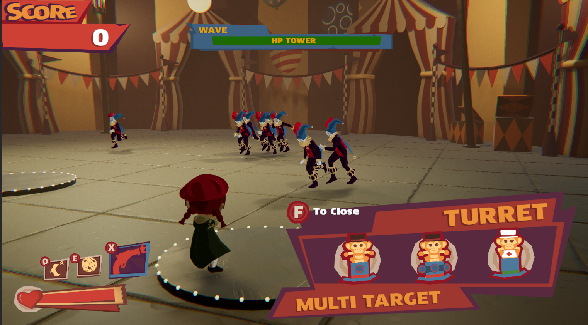
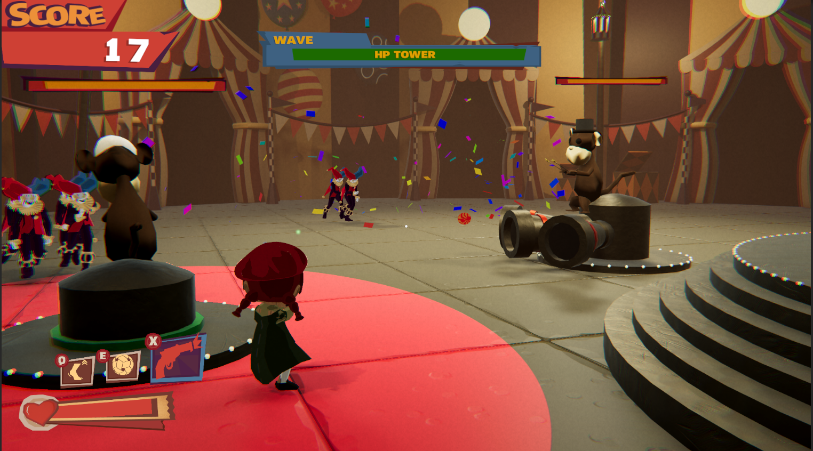
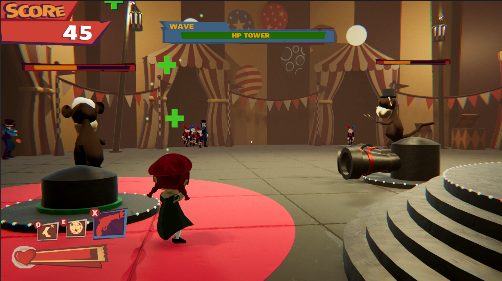

# 🎮 Project: Carnifall
---

## 🎥 Gameplay Showcase


<br>

## 📺 Full Gameplay Video

**[➡️ Watch Full Gameplay Video on YouTube](https://GANTI_INI_DENGAN_LINK_YOUTUBE_KAMU)**

<br>

## 📸 Screenshot Gallery
### Gameplay:




### Source Code:
```text
├───Controls
│       Controller.cs
│
├───Core
│   │
│   ├───Data
│   │   │   DataObjects.cs
│   │   │
│   │   ├───audio
│   │   │   │   AudioData.cs
│   │   │   │   bgm-audio-mixer.mixer
│   │   │   │   sfx-audio-mixer.mixer
│   │   │
│   │   ├───Enemy
│   │   │       EnemyData.cs
│   │   │
│   │   ├───player
│   │   │       PlayerData.cs
│   │   │
│   │   ├───Tower
│   │   │       TowerData.cs
│   │   │
│   │   ├───Turrets
│   │   │       TurretData.cs
│   │   │
│   │   └───Utility
│   │           ProjectileData.cs
│   │
│   ├───decorator
│   ├───Entities
│   │   │   PooledObjects.cs
│   │   │   PooledProjectile.cs
│   │   │   Tower.cs
│   │   │
│   │   ├───AI
│   │   │       BossAI.cs
│   │   │       EnemyAI.cs
│   │   │       MeleeEnemyAI.cs
│   │   │       RangedEnemyAI.cs
│   │   │
│   │   ├───Grenade
│   │   │       ExplotionSystem.cs
│   │   │       GrenadeSystem.cs
│   │   │
│   │   ├───State
│   │   │   │
│   │   │   ├───EnemieState
│   │   │   │       ChaseState.cs
│   │   │   │       EnemyState.cs
│   │   │   │       JumpingState.cs
│   │   │   │       MeleeAttackState.cs
│   │   │   │       RangedAttackState.cs
│   │   │   │       StunnedState.cs
│   │   │   │
│   │   │   └───TurretState
│   │   │           TurretFiringState.cs
│   │   │           TurretIdleState.cs
│   │   │           TurretState.cs
│   │   │
│   │   └───Turrets
│   │           BaseTurret.cs
│   │           HealingTurret.cs
│   │           MultipleTargetTurret.cs
│   │           SIngleTargetTurret.cs
│   │
│   ├───factory
│   ├───observer
│   ├───singleton
│   │   │   singleton.cs
│   │   │
│   │   └───singletons
│   │           AudioManager.cs
│   │           CheatManager.cs
│   │           ComponentManager.cs
│   │           GameManager.cs
│   │           InputManager.cs
│   │           LevelManager.cs
│   │           UiManager.cs
│   │
│   └───state
│       │   GameState.cs
│       │   StateInterface.cs
│       │
│       └───states
│               BuildTurretState.cs
│               GameOverState.cs
│               GameplayState.cs
│               MainMenuState.cs
│               PauseState.cs
│
├───Manager
│       EnemySpawner.cs
│       ObjectPoolManager.cs
│       PooledObjects.cs
│       TurretManager.cs
│       WaveManager.cs
│
├───single
│   │
│   ├───base
│   │   │
│   │   ├───Health
│   │   │       HealthData.cs
│   │   │       HealthSystem.cs
│   │   │
│   │   └───movement
│   │           PlayerMovementData.cs
│   │
│   ├───button
│   │       ButtonHover.cs
│   │
│   ├───camera
│   │       TPSCamera.cs
│   │
│   ├───enemy
│   ├───loading
│   │       TypeWriter.cs
│   │
│   ├───player
│   │       PlayerAnimation.cs
│   │       PlayerFire.cs
│   │       PlayerFootsteps.cs
│   │       PlayerHealth.cs
│   │       PlayerInteract.cs
│   │       PlayerInterface.cs
│   │       PlayerMovement.cs
│   │       PlayerSkills.cs
│   │
│   ├───trigger
│   │       trigger.cs
│   │
│   └───ui
│           UiLookAt.cs
│
└───UI
        GameUI.cs
```
<br>

**[⬅️ Back to Main Profile](../../)**
