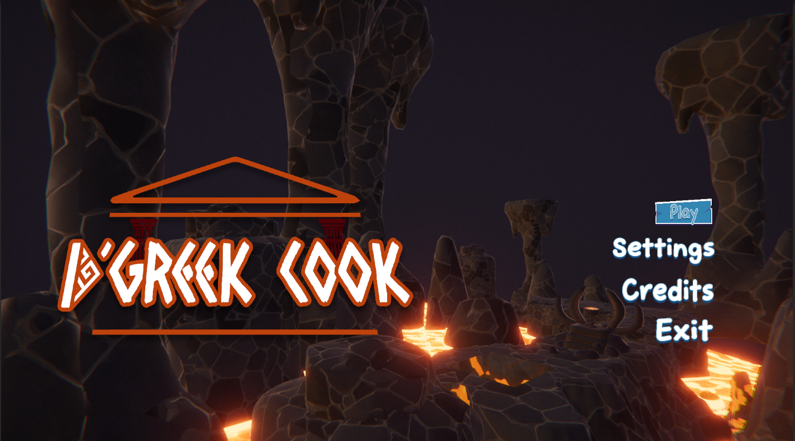
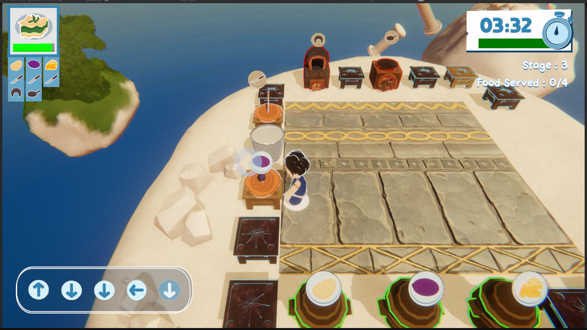
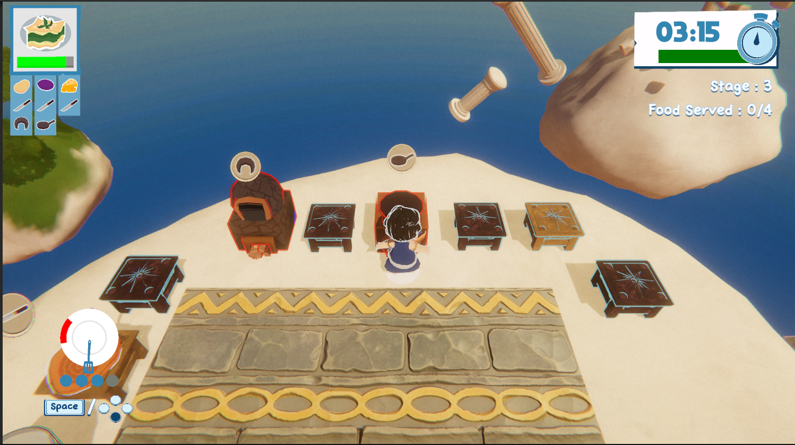

# 🎮 Project: Dgreek Cook
---

## 🎥 Gameplay Showcase


<br>

## 📺 Full Gameplay Video

**[➡️ Watch Full Gameplay Video on YouTube](https://GANTI_INI_DENGAN_LINK_YOUTUBE_KAMU)**

<br>

## 📸 Screenshot Gallery
### Gameplay:




### Source Code:
```text
│
├───core
├───single
│   │   HorizontalLayout3D.cs
│   │   UISelector.cs
│   │
│   ├───camera
│   │       camerainterface.cs
│   │       PlayerCamera.cs
│   │
│   ├───kitchen
│   │       AltarSystem.cs
│   │       CutSystem.cs
│   │       DishSystem.cs
│   │       IngredientsSystem.cs
│   │       kitcheninterface.cs
│   │       OvenSystem.cs
│   │       StoveSystem.cs
│   │       TableSystem.cs
│   │
│   ├───player
│   │       AnimationBridge.cs
│   │       AnimationHandler.cs
│   │       ComboState.cs
│   │       MovementState.cs
│   │       PlayerInteract.cs
│   │       playerinterface.cs
│   │       PlayerState.cs
│   │       playerstateinterface.cs
│   │       SkillCheckState.cs
│   │       StunState.cs
│   │
│   └───trigger
│           Trigger.cs
│           TriggerAltar.cs
│           TriggerBin.cs
│           TriggerCut.cs
│           TriggerDish.cs
│           TriggerFall.cs
│           TriggerIngredients.cs
│           TriggerKitchen.cs
│           TriggerOven.cs
│           TriggerStove.cs
│           TriggerTable.cs
│
├───singleton
│       AudioManager.cs
│       CheatManager.cs
│       ComponentManager.cs
│       GameManager.cs
│       InputManager.cs
│       KitchenSetManager.cs
│       LevelManager.cs
│       ObjectPoolManager.cs
│       ObstacleManager.cs
│       OrderManager.cs
│       PlatformManager.cs
│       singleton.cs
│       StageManager.cs
│       UiManager.cs
│
└───state
    │   GameState.cs
    │   stateinterface.cs
    │
    └───sub-state
            FinishGameState.cs
            GameOverState.cs
            GameplayState.cs
            LobyState.cs
            MainMenuState.cs
            PauseState.cs
```
<br>

**[⬅️ Back to Main Profile](https://github.com/XTripsy)**
