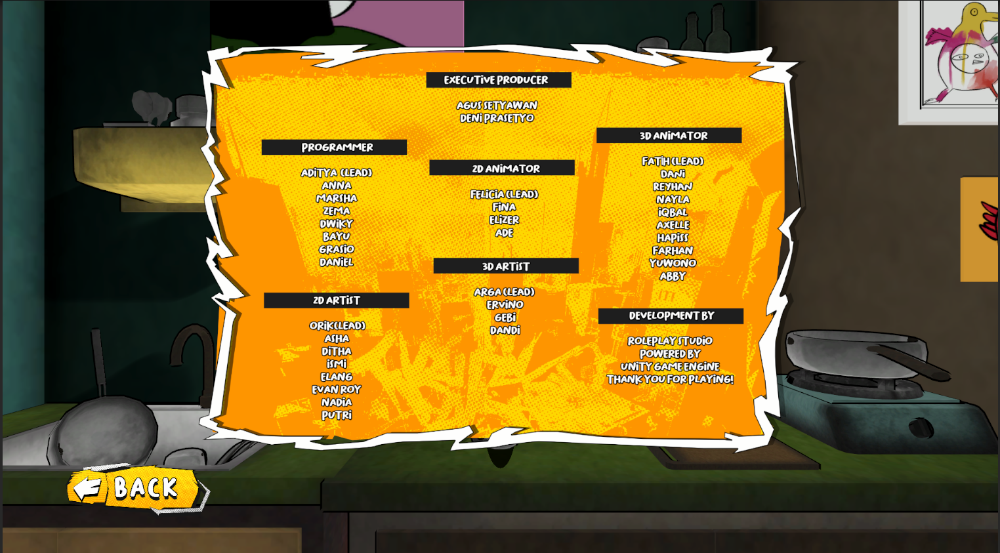

# 🎮 Project: Indekos
---

## 🎥 Gameplay Showcase


<br>

## 📺 Full Gameplay Video

**-**

<br>

## 📸 Screenshot Gallery
### Gameplay:


### Source Code:
```text
│
├───core
│   │   AudioManager.cs
│   │   CharacterManager.cs
│   │   CheatManager.cs
│   │   ChitChatManager.cs
│   │   ComponentManager.cs
│   │   DateTimeManager.cs
│   │   FootstepEvent.cs
│   │   GameManager.cs
│   │   InputManager.cs
│   │   LevelManager.cs
│   │   QuestManager.cs
│   │   SaveLoadManager.cs
│   │   StoryManager.cs
│   │   StudyManager.cs
│   │   UIManager.cs
│   │
│   ├───additional
│   │       Encryption.cs
│   │       ReadmeIndekos.cs
│   │       TriggerAction.cs
│   │       TriggerDestroyAction.cs
│   │       TriggerDialogueNPC.cs
│   │       TriggerDoor.cs
│   │       TriggerInput.cs
│   │       TriggerInputChitChat.cs
│   │       TriggerInputDestroy.cs
│   │       TriggerManager.cs
│   │       TriggerSleep.cs
│   │
│   └───pattern
│       │   singleton.cs
│       │
│       ├───input
│       │       InputBridge.cs
│       │
│       └───state
│           │   GameState.cs
│           │   stateinterface.cs
│           │
│           └───game state
│                   BookState.cs
│                   CutsceneState.cs
│                   GameplayState.cs
│                   GuitarFinalState.cs
│                   GuitarState.cs
│                   MainMenuState.cs
│                   MapState.cs
│                   MingsutState.cs
│                   MinimarketState.cs
│                   NextDayState.cs
│                   NoneState.cs
│                   OpeningState.cs
│                   PauseState.cs
│                   SelectCharacterState.cs
│                   StudyState.cs
│                   TarotState.cs
│
├───editor
│   │   ComponentSaveListWindow.cs
│   │   GranularApplyWindow.cs
│   │   HierarchyHighlighter.cs
│   │   PlayModeSave.cs
│   │
│   ├───data
│   │       HierarchyHighlighter.json
│   │
│
└───system
    │
    ├───audio
    │       BGM.cs
    │       SFX.cs
    │
    ├───loading
    │       LoadingController.cs
    │
    ├───MiniGame
    │   │
    │   ├───Gitar
    │   │       DataGuitar.asset
    │   │       GuitarData.cs
    │   │
    │   ├───guitar final
    │   │       DataGuitarFinal.asset
    │   │       GuitarFinalData.cs
    │   │       GuitarFinalNote.cs
    │   │
    │   └───Mingsut
    ├───minimap
    │       MiniMapController.cs
    │
    ├───NPC
    │       Crowd.cs
    │       NpcController.cs
    │
    ├───Quest
    │       Quest.cs
    │       QuestController.cs
    │       questcontrollerinterface.cs
    │       UiQuestSystem.cs
    │
    ├───Scene
    │       DayController.cs
    │
    ├───tarot
    │       TarotBook.cs
    │
    ├───Time
    └───UI
        │   ButtonHover.cs
        │   date-ui.meta
        │   UIBindSystem.cs
```
<br>

**[⬅️ Back to Main Profile](https://github.com/XTripsy)**
