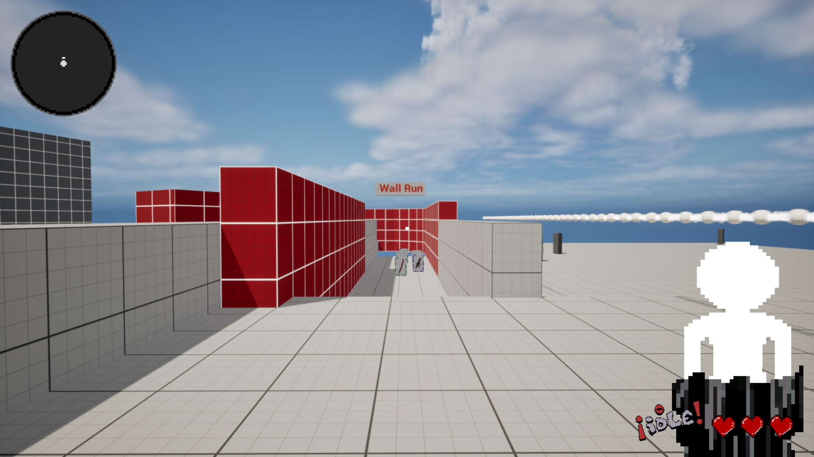
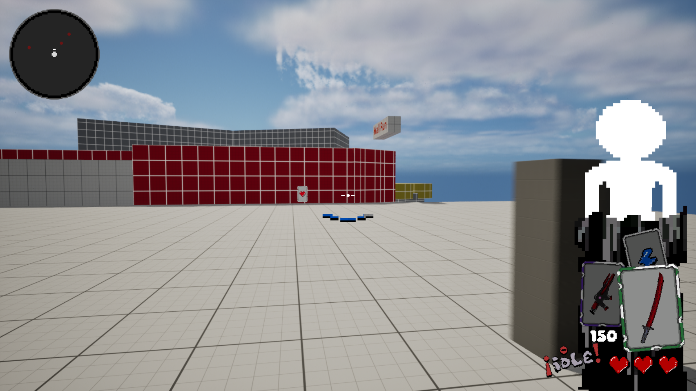
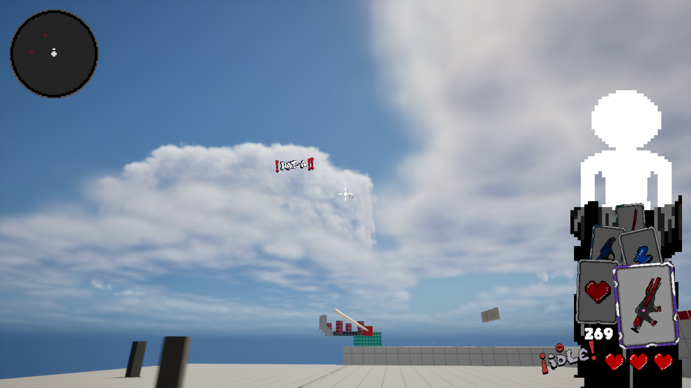
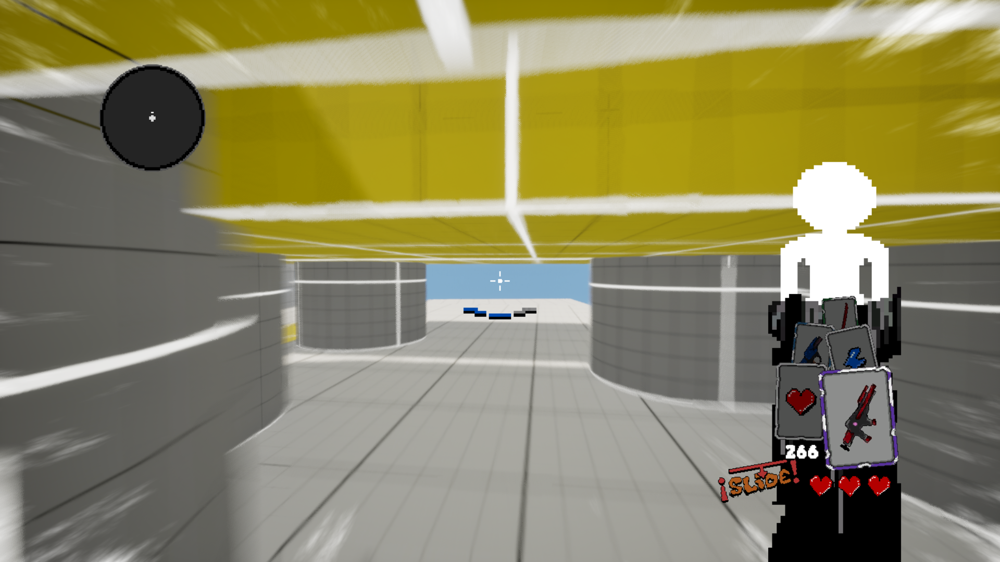
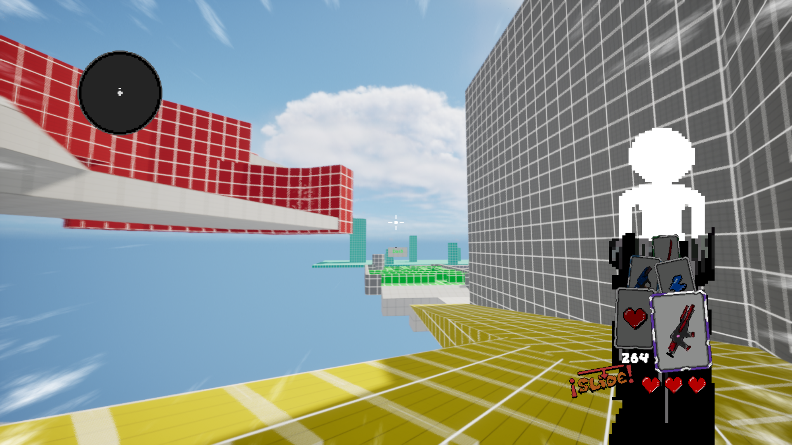
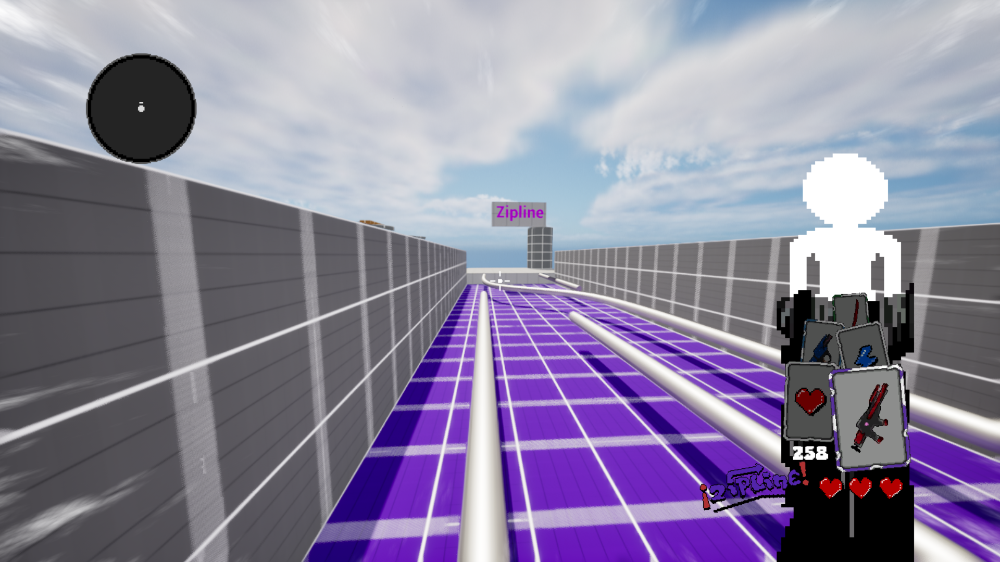
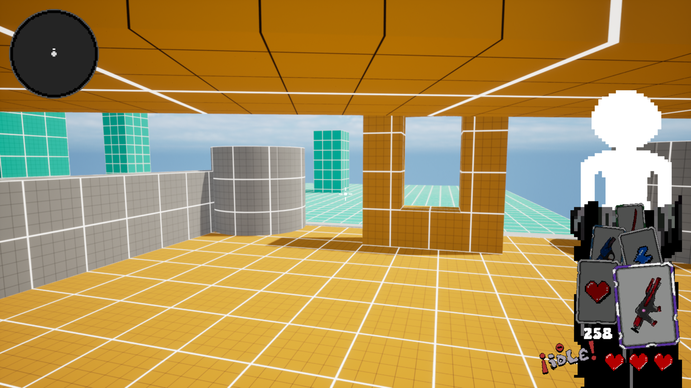
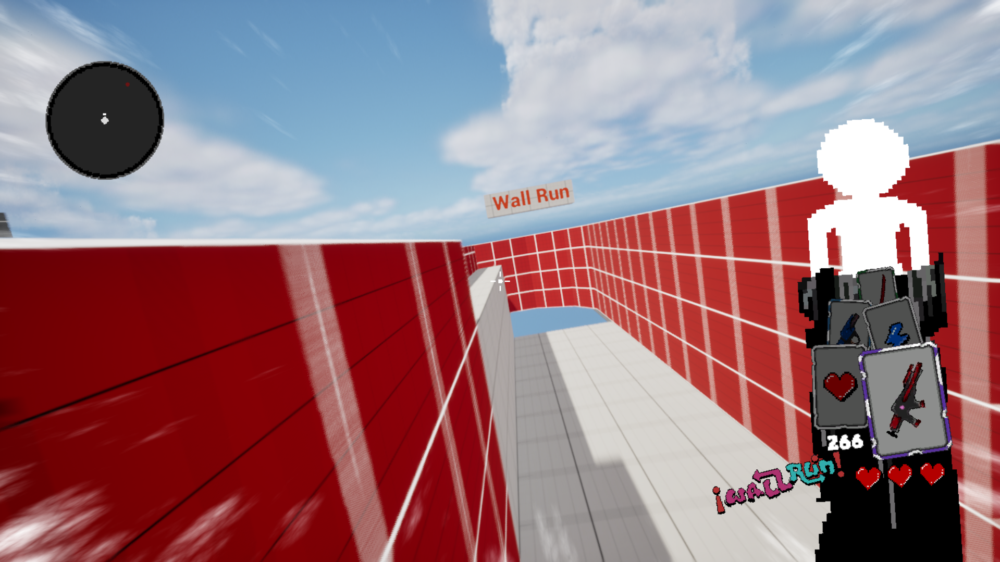
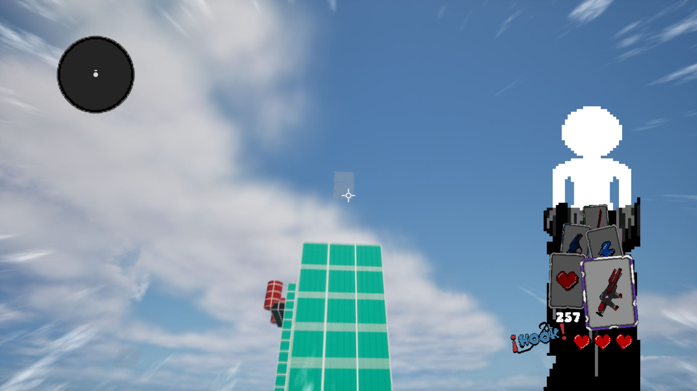

# 🎮 Project: Neo Strife
---

## 🎥 Gameplay Showcase


<br>

## 📺 Full Gameplay Video

**[➡️ Watch Full Gameplay Video on YouTube](https://GANTI_INI_DENGAN_LINK_YOUTUBE_KAMU)**

<br>

## 📸 Screenshot Gallery
### Gameplay:










### Source Code:
```text
C:.
│   Card.cpp
│   Card.h
│   DataCard.cpp
│   DataCard.h
│   NeoStrife.Build.cs
│   NeoStrife.cpp
│   NeoStrife.h
│   NeoStrifeCharacter.cpp
│   NeoStrifeCharacter.h
│   NeoStrifeGameMode.cpp
│   NeoStrifeGameMode.h
│   NeoStrifeHUD.cpp
│   NeoStrifeHUD.h
│   NeoStrifePlayerController.cpp
│   NeoStrifePlayerController.h
│   Projectile.cpp
│   Projectile.h
│
├───Camera
│       CameraShakeAttack.cpp
│       CameraShakeAttack.h
│       CameraShakeDamaged.cpp
│       CameraShakeDamaged.h
│       CameraShakeDeflect.cpp
│       CameraShakeDeflect.h
│
├───Components
│       CharacterComponent.cpp
│       CharacterComponent.h
│
├───Damage
│       BaseDamageType.cpp
│       BaseDamageType.h
│       DisableCardCCDamageType.cpp
│       DisableCardCCDamageType.h
│       NoneCCDamageType.cpp
│       NoneCCDamageType.h
│       SlowCCDamageType.cpp
│       SlowCCDamageType.h
│       StuntCCDamageType.cpp
│       StuntCCDamageType.h
│
├───Global
├───Interface
│       InterfaceCharacter.cpp
│       InterfaceCharacter.h
│       InterfaceControlled.cpp
│       InterfaceControlled.h
│       InterfaceDamage.cpp
│       InterfaceDamage.h
│       InterfaceGameMode.cpp
│       InterfaceGameMode.h
│       InterfaceHUD.cpp
│       InterfaceHUD.h
│       InterfaceProjectile.cpp
│       InterfaceProjectile.h
│
└───Library
        LibraryCard.cpp
        LibraryCard.h
        LibraryFunction.cpp
        LibraryFunction.h
```
<br>

**[⬅️ Back to Main Profile](https://github.com/XTripsy)**
