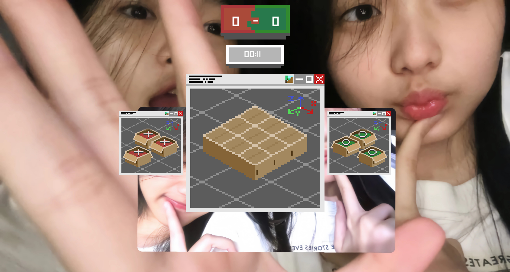
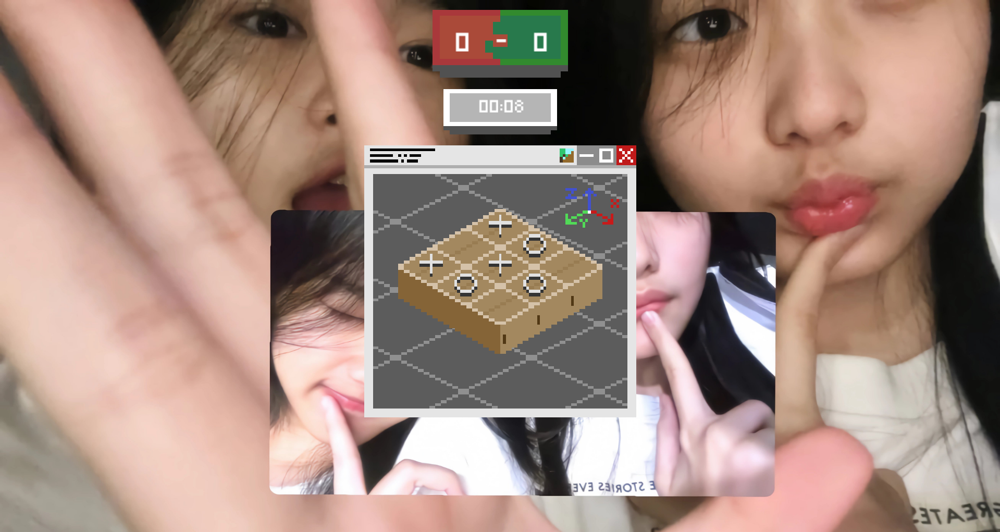

# 🎮 Project: Triple Shift
---

## 🎥 Gameplay Showcase


<br>

## 📺 Full Gameplay Video

**[➡️ Watch Full Gameplay Video on YouTube](https://youtu.be/vjDkzQfKv-s)**

<br>

## 📸 Screenshot Gallery
### Gameplay:






### Source Code:
```text
|
│   glad.c
│   imgui.ini
│   main.cpp
│
├───assets
│   ├───board
│   │       Bomb_Box.png
│   │       Box.png
│   │       Kayu_V2.png
│   │
│   ├───data_levels
│   │       gameover_level.json
│   │       gameplay_level.json
│   │       mainmenu_level.json
│   │       pause_level.json
│   │
│   ├───font
│   │       Pixeled.ttf
│   │
│   ├───obstacles
│   │       books.png
│   │
│   ├───player
│   │       Gaco_O.png
│   │       Gaco_O_Tanpa_Bayangan.png
│   │       Gaco_X.png
│   │       Gaco_X_Tanpa_Bayangan.png
│   │       O_Aktif.png
│   │       X_Aktif.png
│   │
│   ├───UI
│   │       Kardus_Gaco_O.png
│   │       Kardus_Gaco_X.png
│   │       Player_1_Cursor.png
│   │       Player_2_Cursor.png
│   │       Scoreboard.png
│   │       Stopwatch.png
│   │       Window_Base.png
│   │       Window_Base_Tanpa_Pivot.png
│   │
│   └───VFX
│           explosion.png
│
├───core
│   │   Engine.cpp
│   │   Engine.h
│   │
│   ├───engine
│   │   ├───decorator
│   │   ├───factory
│   │   │       FactoryComponents.h
│   │   │
│   │   ├───input
│   │   │       command.cpp
│   │   │       command.h
│   │   │
│   │   ├───observer
│   │   ├───singleton
│   │   │       GameManager.cpp
│   │   │       GameManager.h
│   │   │       InputManager.cpp
│   │   │       InputManager.h
│   │   │       RenderManager.cpp
│   │   │       RenderManager.h
│   │   │       TimeManager.cpp
│   │   │       TimeManager.h
│   │   │       TweenManager.cpp
│   │   │       TweenManager.h
│   │   │       UIManager.cpp
│   │   │       UIManager.h
│   │   │
│   │   └───state
│   │       │   GameState.cpp
│   │       │   GameState.h
│   │       │
│   │       └───states
│   │               GameOverState.cpp
│   │               GameOverState.h
│   │               GameplayState.cpp
│   │               GameplayState.h
│   │               MainMenuState.cpp
│   │               MainMenuState.h
│   │               PauseState.cpp
│   │               PauseState.h
│   │
│   ├───graphics_pipeline
│   │   │   EBO.cpp
│   │   │   EBO.h
│   │   │   ShaderProgram.cpp
│   │   │   ShaderProgram.h
│   │   │   stb.cpp
│   │   │   Texture.cpp
│   │   │   Texture.h
│   │   │   VAO.cpp
│   │   │   VAO.h
│   │   │   VBO.cpp
│   │   │   VBO.h
│   │   │
│   │   └───shaders
│   │           object.frag
│   │           object.vert
│   │
│   └───patterns
│           decorator.h
│           factory.h
│           observer.h
│           singleton.h
│           state.h
│
├───game
│   ├───entity
│   │   │   Entity.h
│   │   │
│   │   ├───components
│   │   │       BoundingBox.h
│   │   │       Button.h
│   │   │       Sprite.h
│   │   │       TextBlock.h
│   │   │       Transform.h
│   │   │
│   │   └───systems
│   │           SpriteSystem.cpp
│   │           SpriteSystem.h
│   │
│   ├───level
│   │       Level.cpp
│   │       Level.h
│   │
│   ├───logic
│   │       PlayerController.cpp
│   │       PlayerController.h
│   │
│   ├───ray
│   │       RayLine.cpp
│   │       RayLine.h
│   │
│   ├───time
│   │       TurnTimer.cpp
│   │       TurnTimer.h
│   │
│   └───tween
│       │   TweenTransform.cpp
│       │   TweenTransform.h
│       │
│       ├───data
│       │       TweenDatas.h
│       │
│       └───interface
│               InterfaceTween.h
│
├───libraries
│   ├───include
│   │   ├───glad
│   │   │       glad.h
│   │   │
│   │   ├───GLFW
│   │   │       glfw3.h
│   │   │       glfw3native.h
│   │   │
│   │   ├───glm
│   │   │   │   CMakeLists.txt
│   │   │   │   common.hpp
│   │   │   │   copying.txt
│   │   │   │   exponential.hpp
│   │   │   │   ext.hpp
│   │   │   │   fwd.hpp
│   │   │   │   geometric.hpp
│   │   │   │   glm.cppm
│   │   │   │   glm.hpp
│   │   │   │   integer.hpp
│   │   │   │   mat2x2.hpp
│   │   │   │   mat2x3.hpp
│   │   │   │   mat2x4.hpp
│   │   │   │   mat3x2.hpp
│   │   │   │   mat3x3.hpp
│   │   │   │   mat3x4.hpp
│   │   │   │   mat4x2.hpp
│   │   │   │   mat4x3.hpp
│   │   │   │   mat4x4.hpp
│   │   │   │   matrix.hpp
│   │   │   │   packing.hpp
│   │   │   │   trigonometric.hpp
│   │   │   │   vec2.hpp
│   │   │   │   vec3.hpp
│   │   │   │   vec4.hpp
│   │   │   │   vector_relational.hpp
│   │   │   │
│   │   │   ├───detail
│   │   │   │       compute_common.hpp
│   │   │   │       compute_vector_decl.hpp
│   │   │   │       compute_vector_relational.hpp
│   │   │   │       func_common.inl
│   │   │   │       func_common_simd.inl
│   │   │   │       func_exponential.inl
│   │   │   │       func_exponential_simd.inl
│   │   │   │       func_geometric.inl
│   │   │   │       func_geometric_simd.inl
│   │   │   │       func_integer.inl
│   │   │   │       func_integer_simd.inl
│   │   │   │       func_matrix.inl
│   │   │   │       func_matrix_simd.inl
│   │   │   │       func_packing.inl
│   │   │   │       func_packing_simd.inl
│   │   │   │       func_trigonometric.inl
│   │   │   │       func_trigonometric_simd.inl
│   │   │   │       func_vector_relational.inl
│   │   │   │       func_vector_relational_simd.inl
│   │   │   │       glm.cpp
│   │   │   │       qualifier.hpp
│   │   │   │       setup.hpp
│   │   │   │       type_float.hpp
│   │   │   │       type_half.hpp
│   │   │   │       type_half.inl
│   │   │   │       type_mat2x2.hpp
│   │   │   │       type_mat2x2.inl
│   │   │   │       type_mat2x3.hpp
│   │   │   │       type_mat2x3.inl
│   │   │   │       type_mat2x4.hpp
│   │   │   │       type_mat2x4.inl
│   │   │   │       type_mat3x2.hpp
│   │   │   │       type_mat3x2.inl
│   │   │   │       type_mat3x3.hpp
│   │   │   │       type_mat3x3.inl
│   │   │   │       type_mat3x4.hpp
│   │   │   │       type_mat3x4.inl
│   │   │   │       type_mat4x2.hpp
│   │   │   │       type_mat4x2.inl
│   │   │   │       type_mat4x3.hpp
│   │   │   │       type_mat4x3.inl
│   │   │   │       type_mat4x4.hpp
│   │   │   │       type_mat4x4.inl
│   │   │   │       type_mat4x4_simd.inl
│   │   │   │       type_quat.hpp
│   │   │   │       type_quat.inl
│   │   │   │       type_quat_simd.inl
│   │   │   │       type_vec1.hpp
│   │   │   │       type_vec1.inl
│   │   │   │       type_vec2.hpp
│   │   │   │       type_vec2.inl
│   │   │   │       type_vec3.hpp
│   │   │   │       type_vec3.inl
│   │   │   │       type_vec4.hpp
│   │   │   │       type_vec4.inl
│   │   │   │       type_vec4_simd.inl
│   │   │   │       _features.hpp
│   │   │   │       _fixes.hpp
│   │   │   │       _noise.hpp
│   │   │   │       _swizzle.hpp
│   │   │   │       _swizzle_func.hpp
│   │   │   │       _vectorize.hpp
│   │   │   │
│   │   │   ├───ext
│   │   │   │       matrix_clip_space.hpp
│   │   │   │       matrix_clip_space.inl
│   │   │   │       matrix_common.hpp
│   │   │   │       matrix_common.inl
│   │   │   │       matrix_double2x2.hpp
│   │   │   │       matrix_double2x2_precision.hpp
│   │   │   │       matrix_double2x3.hpp
│   │   │   │       matrix_double2x3_precision.hpp
│   │   │   │       matrix_double2x4.hpp
│   │   │   │       matrix_double2x4_precision.hpp
│   │   │   │       matrix_double3x2.hpp
│   │   │   │       matrix_double3x2_precision.hpp
│   │   │   │       matrix_double3x3.hpp
│   │   │   │       matrix_double3x3_precision.hpp
│   │   │   │       matrix_double3x4.hpp
│   │   │   │       matrix_double3x4_precision.hpp
│   │   │   │       matrix_double4x2.hpp
│   │   │   │       matrix_double4x2_precision.hpp
│   │   │   │       matrix_double4x3.hpp
│   │   │   │       matrix_double4x3_precision.hpp
│   │   │   │       matrix_double4x4.hpp
│   │   │   │       matrix_double4x4_precision.hpp
│   │   │   │       matrix_float2x2.hpp
│   │   │   │       matrix_float2x2_precision.hpp
│   │   │   │       matrix_float2x3.hpp
│   │   │   │       matrix_float2x3_precision.hpp
│   │   │   │       matrix_float2x4.hpp
│   │   │   │       matrix_float2x4_precision.hpp
│   │   │   │       matrix_float3x2.hpp
│   │   │   │       matrix_float3x2_precision.hpp
│   │   │   │       matrix_float3x3.hpp
│   │   │   │       matrix_float3x3_precision.hpp
│   │   │   │       matrix_float3x4.hpp
│   │   │   │       matrix_float3x4_precision.hpp
│   │   │   │       matrix_float4x2.hpp
│   │   │   │       matrix_float4x2_precision.hpp
│   │   │   │       matrix_float4x3.hpp
│   │   │   │       matrix_float4x3_precision.hpp
│   │   │   │       matrix_float4x4.hpp
│   │   │   │       matrix_float4x4_precision.hpp
│   │   │   │       matrix_int2x2.hpp
│   │   │   │       matrix_int2x2_sized.hpp
│   │   │   │       matrix_int2x3.hpp
│   │   │   │       matrix_int2x3_sized.hpp
│   │   │   │       matrix_int2x4.hpp
│   │   │   │       matrix_int2x4_sized.hpp
│   │   │   │       matrix_int3x2.hpp
│   │   │   │       matrix_int3x2_sized.hpp
│   │   │   │       matrix_int3x3.hpp
│   │   │   │       matrix_int3x3_sized.hpp
│   │   │   │       matrix_int3x4.hpp
│   │   │   │       matrix_int3x4_sized.hpp
│   │   │   │       matrix_int4x2.hpp
│   │   │   │       matrix_int4x2_sized.hpp
│   │   │   │       matrix_int4x3.hpp
│   │   │   │       matrix_int4x3_sized.hpp
│   │   │   │       matrix_int4x4.hpp
│   │   │   │       matrix_int4x4_sized.hpp
│   │   │   │       matrix_integer.hpp
│   │   │   │       matrix_integer.inl
│   │   │   │       matrix_projection.hpp
│   │   │   │       matrix_projection.inl
│   │   │   │       matrix_relational.hpp
│   │   │   │       matrix_relational.inl
│   │   │   │       matrix_transform.hpp
│   │   │   │       matrix_transform.inl
│   │   │   │       matrix_uint2x2.hpp
│   │   │   │       matrix_uint2x2_sized.hpp
│   │   │   │       matrix_uint2x3.hpp
│   │   │   │       matrix_uint2x3_sized.hpp
│   │   │   │       matrix_uint2x4.hpp
│   │   │   │       matrix_uint2x4_sized.hpp
│   │   │   │       matrix_uint3x2.hpp
│   │   │   │       matrix_uint3x2_sized.hpp
│   │   │   │       matrix_uint3x3.hpp
│   │   │   │       matrix_uint3x3_sized.hpp
│   │   │   │       matrix_uint3x4.hpp
│   │   │   │       matrix_uint3x4_sized.hpp
│   │   │   │       matrix_uint4x2.hpp
│   │   │   │       matrix_uint4x2_sized.hpp
│   │   │   │       matrix_uint4x3.hpp
│   │   │   │       matrix_uint4x3_sized.hpp
│   │   │   │       matrix_uint4x4.hpp
│   │   │   │       matrix_uint4x4_sized.hpp
│   │   │   │       quaternion_common.hpp
│   │   │   │       quaternion_common.inl
│   │   │   │       quaternion_common_simd.inl
│   │   │   │       quaternion_double.hpp
│   │   │   │       quaternion_double_precision.hpp
│   │   │   │       quaternion_exponential.hpp
│   │   │   │       quaternion_exponential.inl
│   │   │   │       quaternion_float.hpp
│   │   │   │       quaternion_float_precision.hpp
│   │   │   │       quaternion_geometric.hpp
│   │   │   │       quaternion_geometric.inl
│   │   │   │       quaternion_relational.hpp
│   │   │   │       quaternion_relational.inl
│   │   │   │       quaternion_transform.hpp
│   │   │   │       quaternion_transform.inl
│   │   │   │       quaternion_trigonometric.hpp
│   │   │   │       quaternion_trigonometric.inl
│   │   │   │       scalar_common.hpp
│   │   │   │       scalar_common.inl
│   │   │   │       scalar_constants.hpp
│   │   │   │       scalar_constants.inl
│   │   │   │       scalar_integer.hpp
│   │   │   │       scalar_integer.inl
│   │   │   │       scalar_int_sized.hpp
│   │   │   │       scalar_packing.hpp
│   │   │   │       scalar_packing.inl
│   │   │   │       scalar_reciprocal.hpp
│   │   │   │       scalar_reciprocal.inl
│   │   │   │       scalar_relational.hpp
│   │   │   │       scalar_relational.inl
│   │   │   │       scalar_uint_sized.hpp
│   │   │   │       scalar_ulp.hpp
│   │   │   │       scalar_ulp.inl
│   │   │   │       vector_bool1.hpp
│   │   │   │       vector_bool1_precision.hpp
│   │   │   │       vector_bool2.hpp
│   │   │   │       vector_bool2_precision.hpp
│   │   │   │       vector_bool3.hpp
│   │   │   │       vector_bool3_precision.hpp
│   │   │   │       vector_bool4.hpp
│   │   │   │       vector_bool4_precision.hpp
│   │   │   │       vector_common.hpp
│   │   │   │       vector_common.inl
│   │   │   │       vector_double1.hpp
│   │   │   │       vector_double1_precision.hpp
│   │   │   │       vector_double2.hpp
│   │   │   │       vector_double2_precision.hpp
│   │   │   │       vector_double3.hpp
│   │   │   │       vector_double3_precision.hpp
│   │   │   │       vector_double4.hpp
│   │   │   │       vector_double4_precision.hpp
│   │   │   │       vector_float1.hpp
│   │   │   │       vector_float1_precision.hpp
│   │   │   │       vector_float2.hpp
│   │   │   │       vector_float2_precision.hpp
│   │   │   │       vector_float3.hpp
│   │   │   │       vector_float3_precision.hpp
│   │   │   │       vector_float4.hpp
│   │   │   │       vector_float4_precision.hpp
│   │   │   │       vector_int1.hpp
│   │   │   │       vector_int1_sized.hpp
│   │   │   │       vector_int2.hpp
│   │   │   │       vector_int2_sized.hpp
│   │   │   │       vector_int3.hpp
│   │   │   │       vector_int3_sized.hpp
│   │   │   │       vector_int4.hpp
│   │   │   │       vector_int4_sized.hpp
│   │   │   │       vector_integer.hpp
│   │   │   │       vector_integer.inl
│   │   │   │       vector_packing.hpp
│   │   │   │       vector_packing.inl
│   │   │   │       vector_reciprocal.hpp
│   │   │   │       vector_reciprocal.inl
│   │   │   │       vector_relational.hpp
│   │   │   │       vector_relational.inl
│   │   │   │       vector_uint1.hpp
│   │   │   │       vector_uint1_sized.hpp
│   │   │   │       vector_uint2.hpp
│   │   │   │       vector_uint2_sized.hpp
│   │   │   │       vector_uint3.hpp
│   │   │   │       vector_uint3_sized.hpp
│   │   │   │       vector_uint4.hpp
│   │   │   │       vector_uint4_sized.hpp
│   │   │   │       vector_ulp.hpp
│   │   │   │       vector_ulp.inl
│   │   │   │       _matrix_vectorize.hpp
│   │   │   │
│   │   │   ├───gtc
│   │   │   │       bitfield.hpp
│   │   │   │       bitfield.inl
│   │   │   │       color_space.hpp
│   │   │   │       color_space.inl
│   │   │   │       constants.hpp
│   │   │   │       constants.inl
│   │   │   │       epsilon.hpp
│   │   │   │       epsilon.inl
│   │   │   │       integer.hpp
│   │   │   │       integer.inl
│   │   │   │       matrix_access.hpp
│   │   │   │       matrix_access.inl
│   │   │   │       matrix_integer.hpp
│   │   │   │       matrix_inverse.hpp
│   │   │   │       matrix_inverse.inl
│   │   │   │       matrix_transform.hpp
│   │   │   │       matrix_transform.inl
│   │   │   │       noise.hpp
│   │   │   │       noise.inl
│   │   │   │       packing.hpp
│   │   │   │       packing.inl
│   │   │   │       quaternion.hpp
│   │   │   │       quaternion.inl
│   │   │   │       quaternion_simd.inl
│   │   │   │       random.hpp
│   │   │   │       random.inl
│   │   │   │       reciprocal.hpp
│   │   │   │       round.hpp
│   │   │   │       round.inl
│   │   │   │       type_aligned.hpp
│   │   │   │       type_precision.hpp
│   │   │   │       type_precision.inl
│   │   │   │       type_ptr.hpp
│   │   │   │       type_ptr.inl
│   │   │   │       ulp.hpp
│   │   │   │       ulp.inl
│   │   │   │       vec1.hpp
│   │   │   │
│   │   │   ├───gtx
│   │   │   │       associated_min_max.hpp
│   │   │   │       associated_min_max.inl
│   │   │   │       bit.hpp
│   │   │   │       bit.inl
│   │   │   │       closest_point.hpp
│   │   │   │       closest_point.inl
│   │   │   │       color_encoding.hpp
│   │   │   │       color_encoding.inl
│   │   │   │       color_space.hpp
│   │   │   │       color_space.inl
│   │   │   │       color_space_YCoCg.hpp
│   │   │   │       color_space_YCoCg.inl
│   │   │   │       common.hpp
│   │   │   │       common.inl
│   │   │   │       compatibility.hpp
│   │   │   │       compatibility.inl
│   │   │   │       component_wise.hpp
│   │   │   │       component_wise.inl
│   │   │   │       dual_quaternion.hpp
│   │   │   │       dual_quaternion.inl
│   │   │   │       easing.hpp
│   │   │   │       easing.inl
│   │   │   │       euler_angles.hpp
│   │   │   │       euler_angles.inl
│   │   │   │       extend.hpp
│   │   │   │       extend.inl
│   │   │   │       extended_min_max.hpp
│   │   │   │       extended_min_max.inl
│   │   │   │       exterior_product.hpp
│   │   │   │       exterior_product.inl
│   │   │   │       fast_exponential.hpp
│   │   │   │       fast_exponential.inl
│   │   │   │       fast_square_root.hpp
│   │   │   │       fast_square_root.inl
│   │   │   │       fast_trigonometry.hpp
│   │   │   │       fast_trigonometry.inl
│   │   │   │       float_notmalize.inl
│   │   │   │       functions.hpp
│   │   │   │       functions.inl
│   │   │   │       gradient_paint.hpp
│   │   │   │       gradient_paint.inl
│   │   │   │       handed_coordinate_space.hpp
│   │   │   │       handed_coordinate_space.inl
│   │   │   │       hash.hpp
│   │   │   │       hash.inl
│   │   │   │       integer.hpp
│   │   │   │       integer.inl
│   │   │   │       intersect.hpp
│   │   │   │       intersect.inl
│   │   │   │       io.hpp
│   │   │   │       io.inl
│   │   │   │       log_base.hpp
│   │   │   │       log_base.inl
│   │   │   │       matrix_cross_product.hpp
│   │   │   │       matrix_cross_product.inl
│   │   │   │       matrix_decompose.hpp
│   │   │   │       matrix_decompose.inl
│   │   │   │       matrix_factorisation.hpp
│   │   │   │       matrix_factorisation.inl
│   │   │   │       matrix_interpolation.hpp
│   │   │   │       matrix_interpolation.inl
│   │   │   │       matrix_major_storage.hpp
│   │   │   │       matrix_major_storage.inl
│   │   │   │       matrix_operation.hpp
│   │   │   │       matrix_operation.inl
│   │   │   │       matrix_query.hpp
│   │   │   │       matrix_query.inl
│   │   │   │       matrix_transform_2d.hpp
│   │   │   │       matrix_transform_2d.inl
│   │   │   │       mixed_product.hpp
│   │   │   │       mixed_product.inl
│   │   │   │       norm.hpp
│   │   │   │       norm.inl
│   │   │   │       normal.hpp
│   │   │   │       normal.inl
│   │   │   │       normalize_dot.hpp
│   │   │   │       normalize_dot.inl
│   │   │   │       number_precision.hpp
│   │   │   │       optimum_pow.hpp
│   │   │   │       optimum_pow.inl
│   │   │   │       orthonormalize.hpp
│   │   │   │       orthonormalize.inl
│   │   │   │       pca.hpp
│   │   │   │       pca.inl
│   │   │   │       perpendicular.hpp
│   │   │   │       perpendicular.inl
│   │   │   │       polar_coordinates.hpp
│   │   │   │       polar_coordinates.inl
│   │   │   │       projection.hpp
│   │   │   │       projection.inl
│   │   │   │       quaternion.hpp
│   │   │   │       quaternion.inl
│   │   │   │       range.hpp
│   │   │   │       raw_data.hpp
│   │   │   │       raw_data.inl
│   │   │   │       rotate_normalized_axis.hpp
│   │   │   │       rotate_normalized_axis.inl
│   │   │   │       rotate_vector.hpp
│   │   │   │       rotate_vector.inl
│   │   │   │       scalar_multiplication.hpp
│   │   │   │       scalar_relational.hpp
│   │   │   │       scalar_relational.inl
│   │   │   │       spline.hpp
│   │   │   │       spline.inl
│   │   │   │       std_based_type.hpp
│   │   │   │       std_based_type.inl
│   │   │   │       string_cast.hpp
│   │   │   │       string_cast.inl
│   │   │   │       texture.hpp
│   │   │   │       texture.inl
│   │   │   │       transform.hpp
│   │   │   │       transform.inl
│   │   │   │       transform2.hpp
│   │   │   │       transform2.inl
│   │   │   │       type_aligned.hpp
│   │   │   │       type_aligned.inl
│   │   │   │       type_trait.hpp
│   │   │   │       type_trait.inl
│   │   │   │       vector_angle.hpp
│   │   │   │       vector_angle.inl
│   │   │   │       vector_query.hpp
│   │   │   │       vector_query.inl
│   │   │   │       vec_swizzle.hpp
│   │   │   │       wrap.hpp
│   │   │   │       wrap.inl
│   │   │   │
│   │   │   └───simd
│   │   │           common.h
│   │   │           exponential.h
│   │   │           geometric.h
│   │   │           integer.h
│   │   │           matrix.h
│   │   │           neon.h
│   │   │           packing.h
│   │   │           platform.h
│   │   │           trigonometric.h
│   │   │           vector_relational.h
│   │   │
│   │   ├───imgui
│   │   │       imconfig.h
│   │   │       imgui.cpp
│   │   │       imgui.h
│   │   │       imgui_demo.cpp
│   │   │       imgui_draw.cpp
│   │   │       imgui_impl_glfw.cpp
│   │   │       imgui_impl_glfw.h
│   │   │       imgui_impl_opengl3.cpp
│   │   │       imgui_impl_opengl3.h
│   │   │       imgui_impl_opengl3_loader.h
│   │   │       imgui_internal.h
│   │   │       imgui_tables.cpp
│   │   │       imgui_widgets.cpp
│   │   │       imstb_rectpack.h
│   │   │       imstb_textedit.h
│   │   │       imstb_truetype.h
│   │   │
│   │   ├───KHR
│   │   │       khrplatform.h
│   │   │
│   │   ├───nlohmann
│   │   │   │   adl_serializer.hpp
│   │   │   │   byte_container_with_subtype.hpp
│   │   │   │   json.hpp
│   │   │   │   json_fwd.hpp
│   │   │   │   ordered_map.hpp
│   │   │   │
│   │   │   ├───detail
│   │   │   │   │   abi_macros.hpp
│   │   │   │   │   exceptions.hpp
│   │   │   │   │   hash.hpp
│   │   │   │   │   json_custom_base_class.hpp
│   │   │   │   │   json_pointer.hpp
│   │   │   │   │   json_ref.hpp
│   │   │   │   │   macro_scope.hpp
│   │   │   │   │   macro_unscope.hpp
│   │   │   │   │   string_concat.hpp
│   │   │   │   │   string_escape.hpp
│   │   │   │   │   string_utils.hpp
│   │   │   │   │   value_t.hpp
│   │   │   │   │
│   │   │   │   ├───conversions
│   │   │   │   │       from_json.hpp
│   │   │   │   │       to_chars.hpp
│   │   │   │   │       to_json.hpp
│   │   │   │   │
│   │   │   │   ├───input
│   │   │   │   │       binary_reader.hpp
│   │   │   │   │       input_adapters.hpp
│   │   │   │   │       json_sax.hpp
│   │   │   │   │       lexer.hpp
│   │   │   │   │       parser.hpp
│   │   │   │   │       position_t.hpp
│   │   │   │   │
│   │   │   │   ├───iterators
│   │   │   │   │       internal_iterator.hpp
│   │   │   │   │       iteration_proxy.hpp
│   │   │   │   │       iterator_traits.hpp
│   │   │   │   │       iter_impl.hpp
│   │   │   │   │       json_reverse_iterator.hpp
│   │   │   │   │       primitive_iterator.hpp
│   │   │   │   │
│   │   │   │   ├───meta
│   │   │   │   │   │   cpp_future.hpp
│   │   │   │   │   │   detected.hpp
│   │   │   │   │   │   identity_tag.hpp
│   │   │   │   │   │   is_sax.hpp
│   │   │   │   │   │   std_fs.hpp
│   │   │   │   │   │   type_traits.hpp
│   │   │   │   │   │   void_t.hpp
│   │   │   │   │   │
│   │   │   │   │   └───call_std
│   │   │   │   │           begin.hpp
│   │   │   │   │           end.hpp
│   │   │   │   │
│   │   │   │   └───output
│   │   │   │           binary_writer.hpp
│   │   │   │           output_adapters.hpp
│   │   │   │           serializer.hpp
│   │   │   │
│   │   │   └───thirdparty
│   │   │       └───hedley
│   │   │               hedley.hpp
│   │   │               hedley_undef.hpp
│   │   │
│   │   └───stb
│   │           stb_image.h
│   │
│   └───lib
│           glfw3.lib
│
```
<br>

**[⬅️ Back to Main Profile](https://github.com/XTripsy)**
